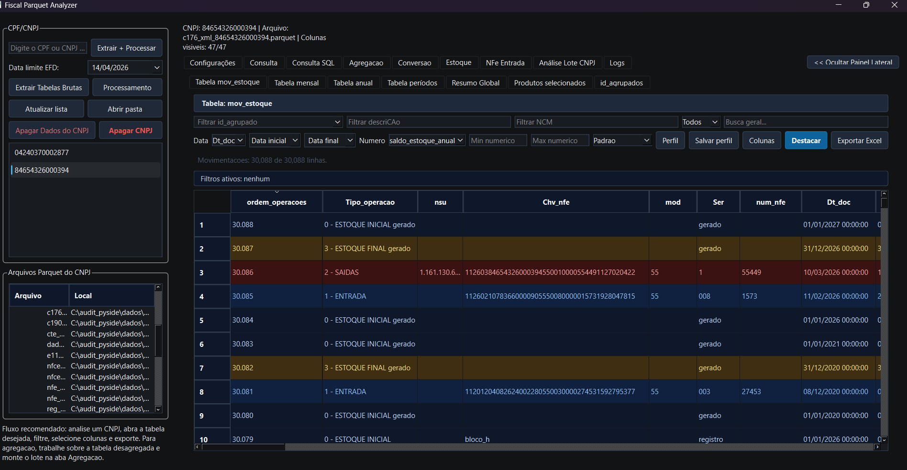
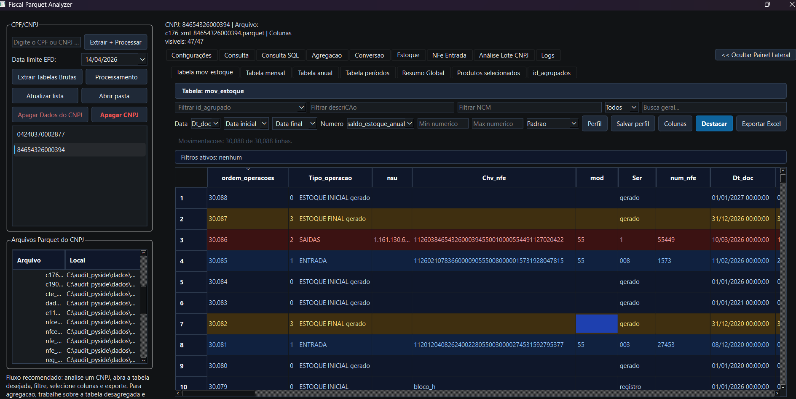
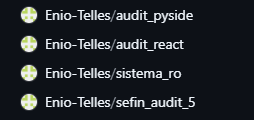

# Interface React - Tabelas, Filtros e Perfis Implementation Plan

> **For agentic workers:** REQUIRED SUB-SKILL: Use superpowers:subagent-driven-development (recommended) or superpowers:executing-plans to implement this plan task-by-task. Steps use checkbox (`- [ ]`) syntax for tracking.

**Goal:** tornar as tabelas da interface React visualizaveis da forma mais completa possivel, com filtros por coluna, busca flexivel na agregacao manual e perfis persistidos de ordem/visibilidade de colunas.

**Architecture:** manter o React como shell operacional local sobre os endpoints Python/Parquet existentes. Toda regra fiscal continua no pipeline Python; o frontend apenas filtra, ordena, apresenta, salva preferencias visuais locais e envia comandos operacionais ja existentes. A evolucao sera incremental: primeiro helpers testaveis, depois componente de tabela reutilizavel, depois migracao por aba.

**Tech Stack:** Python local server (`app_react.py`), React UMD em `audit_pyside_frontend.html`, JavaScript estatico em `audit_react/`, CSS em `audit_react/theme.css`, testes `pytest` chamando Node para helpers JavaScript puros.

---

## Contexto e referencias

- Interface React atual: `audit_pyside_frontend.html` carrega `audit_react/data.js`, `components-base.jsx`, `tab-similaridade.jsx`, `tabs-other.jsx`, `tab-agregacao-unificada.jsx`, `tab-lote.jsx`.
- Tabelas atuais: renderizadas manualmente em cada aba, com filtros parciais e botoes de perfil/colunas ainda quase decorativos.
- Exemplo PySide/GitHub local: o checkout `C:\audit_pyside` ja tem inventario de filtros e perfis em `docs/refactor_main_window_inventory.md`, com funcoes como `_aplicar_perfil_tabela`, `_salvar_perfil_tabela_com_dialogo`, `_dataframe_colunas_perfil` e filtros por tabela.
- Restricao fiscal: nao implementar regra fiscal no React; preservar colunas sensiveis (`id_agrupado`, `id_agregado`, `__qtd_decl_final_audit__`, `q_conv`, `q_conv_fisica`) quando presentes.

## Arquivos e responsabilidades

- Criar: `audit_react/table-utils.js`
  - Normalizacao de texto, busca flexivel, filtros por coluna, perfis de coluna e persistencia local.
  - Exporta para `window.AUDIT_TABLE_UTILS` e `module.exports` para teste em Node.
- Criar: `audit_react/data-grid.jsx`
  - Componente React reutilizavel para tabelas completas: filtros por coluna, seletor de perfil, menu simples de colunas, contagem de linhas, ordenacao e renderizacao customizada.
- Modificar: `audit_pyside_frontend.html`
  - Carregar `table-utils.js` antes dos componentes React e `data-grid.jsx` antes das abas.
- Modificar: `audit_react/tab-similaridade.jsx`
  - Substituir busca simples por busca flexivel e filtros por coluna.
  - Adicionar perfis: `Completo`, `Fiscal`, `Revisao manual`, `Score`.
- Modificar: `audit_react/tabs-other.jsx`
  - Migrar `AgregacaoTab`, `ConversaoTab`, `EstoqueTab`, `ConsultaTab` para `DataGrid` em etapas.
- Criar: `tests/test_table_utils.py`
  - Testes dos helpers JS via Node sem browser.

## Contrato de busca flexivel

- Texto simples: `heineken lata` exige todos os termos em qualquer coluna pesquisavel.
- Frase exata: `"CERVEJA HEINEKEN"` exige a frase preservada.
- Exclusao: `-long` remove linhas contendo o termo.
- Campo especifico: `ncm:22030000`, `cest:0302100`, `motivo:GTIN`.
- Comparadores numericos: `score>=80`, `bloco=14`, `camada<=2`.
- Alternativas: `heineken|budweiser` aceita qualquer alternativa.
- Normalizacao: ignora caixa, acentos, pontuacao comum e espacos repetidos.

## Perfis de colunas

- Perfil define:
  - `visible`: colunas visiveis.
  - `order`: ordem preferida.
  - `pinned`: reservado para futuro; nao bloquear MVP.
  - `filters`: filtros salvos opcionalmente.
- Perfis padrao por tabela:
  - `Completo`: todas as colunas conhecidas.
  - `Fiscal`: identificadores fiscais, descricao, NCM, CEST, GTIN, UN, origem.
  - `Revisao manual`: colunas de selecao, descricao, bloco, motivo, score e chaves.
  - `Score`: score/motivo/camada/bloco com identificadores minimos.
- Persistencia local: `localStorage["audit.tableProfile.<tableId>"]`.
- Rollback: se perfil salvo estiver invalido, aplicar `Completo`.

## Plano por etapas

### Task 1: Helpers JS testaveis para filtros e perfis

**Files:**
- Create: `audit_react/table-utils.js`
- Create: `tests/test_table_utils.py`
- Modify: `audit_pyside_frontend.html`

- [x] **Step 1: Write failing tests**

Cobrir:
- busca com termos, frase, exclusao e campo especifico;
- comparador numerico;
- filtro por coluna;
- perfil que ordena colunas e preserva colunas restantes no final.

- [x] **Step 2: Run test to verify it fails**

Run: `python -m pytest tests\test_table_utils.py -q`

Expected before implementation: FAIL because `audit_react/table-utils.js` is missing.

- [x] **Step 3: Implement minimal helpers**

Implementar `normalizeText`, `parseFlexibleQuery`, `rowMatchesFlexibleQuery`, `applyColumnFilters`, `applyColumnProfile`.

- [x] **Step 4: Run tests**

Run: `python -m pytest tests\test_table_utils.py -q`

Expected: PASS.

### Task 2: DataGrid reutilizavel

**Files:**
- Create: `audit_react/data-grid.jsx`
- Modify: `audit_react/theme.css`
- Modify: `audit_pyside_frontend.html`

- [ ] **Step 1: Create component shell**

Props:
- `tableId`
- `rows`
- `columns`
- `profiles`
- `defaultProfile`
- `rowKey`
- `selectedIds`
- `onRowClick`
- `rowClassName`

- [ ] **Step 2: Add per-column filters**

Cada coluna visivel deve exibir input compacto no header ou linha de filtros. Filtros devem chamar `applyColumnFilters`.

- [ ] **Step 3: Add profile selector and column toggles**

O seletor aplica `applyColumnProfile`. O botao `Colunas` abre painel/dropdown compacto com checkboxes.

- [ ] **Step 4: Validate manually and with smoke**

Run:
- `python -m pytest tests\test_table_utils.py tests\test_app_react.py -q`
- `python app_react.py --no-browser --port 8876`
- Browser: `http://127.0.0.1:8876`

### Task 3: Migrar Similaridade e Agregacao manual

**Files:**
- Modify: `audit_react/tab-similaridade.jsx`
- Modify: `audit_react/tab-agregacao-unificada.jsx`
- Modify: `audit_react/tabs-other.jsx`

- [ ] **Step 1: Define columns da Similaridade**

Colunas: selecao, bloco, desc, ncm, cest, gtin, un, camada, motivo, score.

- [x] **Step 2: Trocar busca simples por busca flexivel**

Usar `rowMatchesFlexibleQuery` para:
- `heineken lata`
- `"CERVEJA HEINEKEN"`
- `ncm:22030000`
- `score>=80`
- `-long`

- [x] **Step 3: Adicionar filtros por coluna**

Cada coluna da tabela central deve aceitar filtro textual ou numerico conforme tipo.

- [x] **Step 4: Adicionar perfis da agregacao**

Perfis: `Completo`, `Fiscal`, `Revisao manual`, `Score`.

- [ ] **Step 5: Validar selecao e painel lateral**

Selecao, marcar para agregar, ignorar bloco e membros do bloco devem continuar funcionando.

### Task 4: Migrar Consulta e Estoque para visualizacao completa

**Files:**
- Modify: `audit_react/tabs-other.jsx`
- Modify: `app_react.py` se for necessario expor schema/preview real de Parquet.

- [ ] **Step 1: ConsultaTab**

Exibir tabela real quando houver dados disponiveis via `/api/dados` ou preview de parquet. Enquanto a API nao expuser preview generico, manter placeholder com plano de endpoint.

- [ ] **Step 2: EstoqueTab**

Migrar `mov_estoque` para `DataGrid`, preservando destaque por tipo de operacao.

- [ ] **Step 3: Subabas mensal/anual/periodos**

Adicionar fonte de dados real ou mock coerente ate endpoint dedicado existir.

- [ ] **Step 4: Exportacao**

Garantir que export respeite colunas visiveis/perfil atual quando implementado no servidor.

### Task 5: Persistencia e compatibilidade operacional

**Files:**
- Modify: `audit_react/table-utils.js`
- Modify: `audit_react/data-grid.jsx`
- Modify: `audit_react/theme.css`

- [ ] **Step 1: Persistir perfil por tabela**

Chave: `audit.tableProfile.<tableId>`.

- [ ] **Step 2: Botao resetar perfil**

Permitir voltar ao perfil `Completo`.

- [ ] **Step 3: Resumo de filtros ativos**

Mostrar `Filtros ativos: nenhum` ou lista curta por coluna/busca.

### Task 6: Validacao final

**Files:**
- Modify: docs deste plano com checkboxes finais.

- [ ] **Step 1: Testes unitarios**

Run:
`python -m pytest tests\test_table_utils.py tests\test_app_react.py tests\test_app.py -q`

- [ ] **Step 2: Smoke do servidor React**

Run:
`python app_react.py --no-browser --port 8876`

Abrir:
`http://127.0.0.1:8876`

- [ ] **Step 3: Checklist visual**

Verificar:
- filtros por coluna funcionam;
- perfis alteram ordem e visibilidade;
- busca flexivel aceita frase, campo, exclusao e comparador;
- selecao/agregacao manual nao perdeu estado;
- layout nao sobrepoe controles;
- nenhuma regra fiscal foi movida para React.

## Riscos e rollback

- Risco: filtros client-side podem ficar lentos em tabelas muito grandes. Mitigacao: primeiro aplicar em datasets carregados no browser; depois adicionar paginacao/preview server-side se necessario.
- Risco: perfil salvo antigo pode esconder coluna importante. Mitigacao: `Completo` como fallback e reset visivel.
- Risco: UI divergir da GUI PySide6. Mitigacao: manter nomenclatura e perfis inspirados nos controladores PySide.
- Rollback: remover `data-grid.jsx`, `table-utils.js`, referencias no HTML e reverter abas para tabelas manuais.

## Checklist de acompanhamento

- [x] Plano Markdown criado.
- [x] Helpers de filtro/perfil implementados.
- [x] Helpers cobertos por testes Node via pytest.
- [x] HTML carrega helpers comuns.
- [x] Similaridade usa busca flexivel.
- [x] Similaridade tem filtros por coluna.
- [x] Similaridade tem perfis de coluna.
- [ ] Agregacao manual usa busca flexivel.
- [ ] Conversao usa `DataGrid`.
- [ ] Estoque usa `DataGrid`.
- [ ] Consulta/preview de parquet definido.
- [ ] Smoke React validado no navegador.
