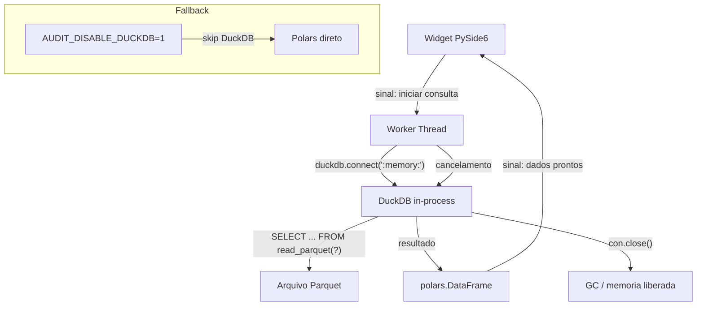

# Referencia Canonica: Integracao Polars + DuckDB

> **D-arch-001** — Decisao de arquitetura aprovada em 2026-04-22  
> Status: **Ativo**  
> Escopo: `src/interface_grafica/` (workers de consulta em Parquet grande)

---

## Contexto

O pipeline principal usa **Polars** para toda a transformacao fiscal.  
Para consultas interativas em Parquets grandes (>512 MB) na interface grafica,
DuckDB e utilizado como motor SQL in-process — sem substituir o Polars e sem
criar dependencia em servidor externo.

**Regra de ouro**: DuckDB aparece _exclusivamente_ em workers de consulta da GUI.
Nunca no pipeline de transformacao, nunca fora de `src/interface_grafica/`.

---

## Decisao (ADR resumido)

| Alternativa | Motivo de descarte |
|---|---|
| Polars puro | Aceitavel ate ~512 MB; acima disso, pressao de memoria na GUI |
| SQLite | Nao le Parquet nativo |
| DuckDB compartilhado | Race condition entre workers; descartado |
| Backend FastAPI | Removido em ADR-001 Opcao B (2026-04-22) |

**Escolha**: cada worker instancia `duckdb.connect(":memory:")` proprio e descarta ao
terminar. Sem estado compartilhado, sem arquivos `.duckdb` persistidos.

---

## Diagrama de fluxo



---

## Quando usar DuckDB vs Polars

| Criterio | Polars | DuckDB |
|---|---|---|
| Arquivo Parquet < 512 MB | **preferido** | opcional |
| Arquivo Parquet >= 512 MB | aceitavel com LazyFrame | **preferido** |
| Pipeline de transformacao | **obrigatorio** | **proibido** |
| Worker de consulta GUI | aceitavel | aceitavel |
| Regra fiscal / calculo | **obrigatorio** | **proibido** |

Limiar configuravel em `src/interface_grafica/config.py`:

```python
LARGE_PARQUET_THRESHOLD_MB: int = 512  # acima disso, worker pode usar DuckDB
```

Variavel de ambiente para desabilitar:

```bash
export AUDIT_DISABLE_DUCKDB=1  # forcca Polars em todos os workers
```

---

## API do worker (contrato)

Todo worker que usa DuckDB deve seguir este padrao:

```python
import os
import duckdb
import polars as pl
from pathlib import Path


def _query_parquet_duckdb(parquet_path: Path, sql: str, params: list) -> pl.DataFrame:
    """Executa SQL parametrizado em Parquet via DuckDB in-memory.

    Regras:
    - Sempre abre conexao nova (":memory:") — nunca reutiliza entre chamadas.
    - Sempre usa params posicionais para evitar SQL injection.
    - Sempre fecha a conexao no bloco finally.
    - Retorna polars.DataFrame (nunca pandas).
    """
    if os.getenv("AUDIT_DISABLE_DUCKDB", "").strip() in {"1", "true", "yes"}:
        # Fallback: Polars LazyFrame scan
        return (
            pl.scan_parquet(parquet_path)
            .collect()
        )

    con = duckdb.connect(":memory:")
    try:
        resultado = con.execute(sql, params).pl()
    finally:
        con.close()
    return resultado
```

### Regras de seguranca SQL

1. **Sempre parametrize** — nunca interpole valores do usuario na string SQL.
2. O caminho do Parquet pode aparecer como literal na query (nao e entrada do usuario),
   mas **valores de filtro** (CNPJ, periodo, etc.) devem ser parametros posicionais `?`.
3. Nao use f-string para montar clausulas `WHERE`.

Exemplo correto:

```python
sql = """
    SELECT *
    FROM read_parquet(?)
    WHERE cnpj = ?
    AND periodo >= ?
"""
params = [str(parquet_path), cnpj, periodo_inicio]
con.execute(sql, params).pl()
```

---

## Thread-safety

- Cada worker instancia **sua propria conexao** `duckdb.connect(":memory:")`.
- **Nao compartilhe** conexoes entre threads — DuckDB in-memory nao e thread-safe
  para multiplas conexoes no mesmo processo sobre o mesmo arquivo sem WAL.
- O arquivo Parquet e **somente leitura** pelos workers — nenhum worker escreve.
- Se o worker for cancelado via sinal PySide6, deve fechar a conexao no bloco `finally`
  antes de encerrar a thread.

---

## Chaves invariantes (contrato com o pipeline)

Qualquer query DuckDB deve **preservar e nao modificar** estas colunas:

| Coluna | Papel |
|---|---|
| `id_agrupado` | Chave mestra de produto |
| `id_agregado` | Alias de apresentacao |
| `__qtd_decl_final_audit__` | Valor de auditoria (nao altera saldo fisico) |
| `q_conv` | Quantidade convertida para unidade de referencia |
| `q_conv_fisica` | Quantidade convertida na perspectiva fisica |

Nunca renomeie, sobrescreva ou descarte essas colunas em resultados retornados
para a GUI ou persistidos em Parquet.

---

## Rollback e fallback

### Desabilitar DuckDB imediatamente

```bash
export AUDIT_DISABLE_DUCKDB=1
```

Qualquer worker que siga o contrato acima ira automaticamente usar Polars.
Nao e necessario reiniciar o processo se a variavel for definida antes do worker iniciar.

### Remover a dependencia completamente

1. Verificar todos os workers em `src/interface_grafica/` que importam `duckdb`.
2. Substituir a chamada `_query_parquet_duckdb` pelo fallback Polars.
3. Remover `duckdb` de `requirements.txt` e `pyproject.toml`.
4. Executar `pytest -q -m "not gui_smoke"` para confirmar zero regressoes.

---

## Arquivos relacionados

| Arquivo | Papel |
|---|---|
| `src/interface_grafica/config.py` | `LARGE_PARQUET_THRESHOLD_MB`, `AUDIT_DISABLE_DUCKDB` |
| `src/interface_grafica/workers.py` | Workers de consulta |
| `requirements.txt` | `duckdb>=0.10` |
| `docs/adr/` | ADR-001 (remocao do backend), futuro ADR-002 (DuckDB) |
| `tests/` | `pytest -q -m "not gui_smoke"` |

---

## Historico

| Data | Evento |
|---|---|
| 2026-04-22 | ADR-001: remocao do backend FastAPI (Opcao B aprovada) |
| 2026-04-22 | D-arch-001: adocao de DuckDB in-memory para workers GUI com Parquet grande |
